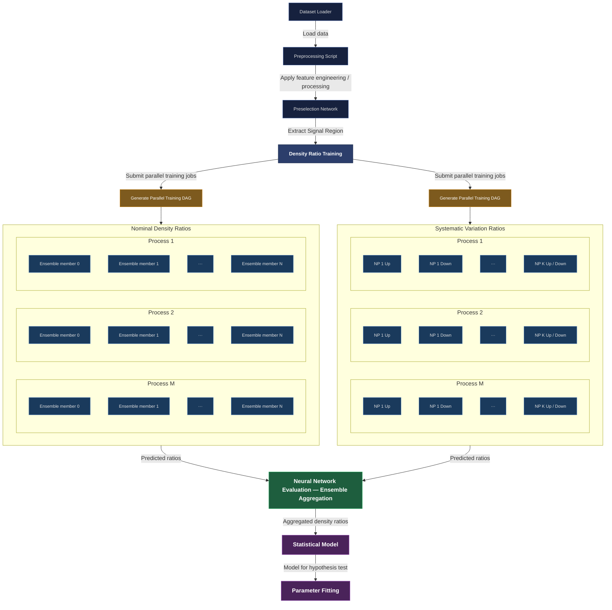

FAIR Universe Dataset
--

The tabular dataset used in this demonstration is hosted on Zenodo (https://zenodo.org/records/15131565), and is created using the particle physics simulation tools Pythia 8.2 and Delphes 3.5.0. The dataset provides events for the $H\to \tau\tau$ analysis, where the signal process is sub-dominant compared to the very large $Z\to \tau\tau$ and other backgrounds - good challenge to test the sensitivty of NSBI techniques.

## Download saved models and processed data 

If you need access to pre-trained ensemble neural networks and preprocessed data, to avoid running each notebook in sequence but rather pick and choose any of them, download the directory from [LINK TBA]().

## Running a HTCondor workflow with DAGMan

If you have access to HTCondor resources, check out the `htcondor/` directory for DAGMan workflow that can be modified to your setup. Here is a preview of the full DAG:



## Systematics-robustness diagnostic

`scripts/systematics_robustness.py` tests whether a discriminant is *robust* under the
real FAIR Universe systematics (TES, JES) — the axis that BCE/AUC cannot see and the one
where a foundation model could help a precision measurement. For each region
(`Nominal`, `JES_Up/Dn`, `TES_Up/Dn`) it scores the signal-region events with the
**nominal** density-ratio ensemble and measures how much the discriminant's output
distribution moves vs nominal (total-variation distance, mean shift). Run it **after**
the nominal density ratios are trained:

```bash
python scripts/systematics_robustness.py --config config.pipeline.yaml \
    --process htautau --out-dir output/robustness
```

Writes `robustness.json` + `robustness.png` (shape shift per systematic; lower = more robust).

The *downstream* impact — whether the profiled μ CI shrinks without systematics — is now
reported by `scripts/parameter_fitting.py` itself: it extracts the ±1σ CI (via
`ci.ci_from_scan`) from the stat+syst and stat-only profile scans it already computes,
logs the **systematic inflation** (stat+syst / stat-only half-width), and saves
`mu_ci.json`. Together these answer "how much do systematics move the discriminant, and
how much do they cost the measurement" — for any discriminant, including an FM once one
that consumes these inputs is plugged in.
